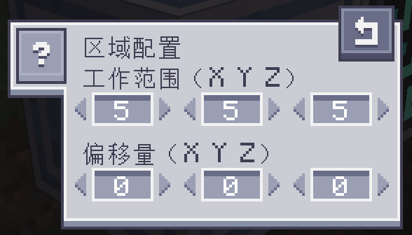

---
navigation:
    parent: epp_intro/epp_intro-index.md
    title: ME吸物接口
    icon: extendedae:vacuum_interface
categories:
- extended devices
item_ids:
- extendedae:vacuum_interface
---

# ME吸物接口

<Row>
<BlockImage id="extendedae:vacuum_interface" scale="8"></BlockImage>
</Row>

ME吸物接口能自动收集其工作区域内掉落的物品，并将它们直接存入相连的ME网络。网络不接受的物品不会被吸收。

## 工作区域

默认工作区域为5x5x5（格）立方体，以接口为中心。可通过“区域配置”按钮调整区域尺寸和各轴上的偏移量。单边长度最大10格，偏移量最大16格。

“显示工作区域”按钮可在世界中显示区域配置。
