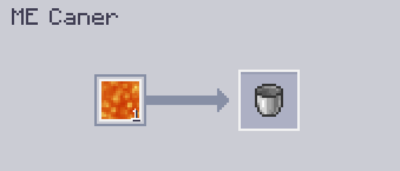

---
navigation:
    parent: epp_intro/epp_intro-index.md
    title: ME Canner
    icon: extendedae:caner
categories:
- extended devices
item_ids:
- extendedae:caner
---

# ME Canner

<BlockImage id="extendedae:caner" scale="8"></BlockImage>

ME Canner is a machine for "canning" materials, including fluids, Mekanism gas, Botania mana, and even energy!

The first slot holds the filling material, and the second slot holds the item to be filled.

It needs energy to run, and each operation costs 80 AE.

By default, it fills only fluids; install the corresponding addon to make it fill other materials.

### Supported addons:
- Applied Flux
- Applied Mekanistics
- Applied Botanics Addon

## Autocrafting with ME Caner

Only the top and bottom sides can accept energy and connect to the network.

<GameScene zoom="6" background="transparent">
  <ImportStructure src="../structure/caner_example.snbt"></ImportStructure>
</GameScene>

A simple setup for ME Canner. ME Canner automatically ejects the filled item when it receives ingredients from <ItemLink id="ae2:pattern_provider" />.

<GameScene zoom="6" background="transparent">
  <ImportStructure src="../structure/caner_auto.snbt"></ImportStructure>
</GameScene>

The pattern must contain only the filling material and the container to be filled. Here are some examples:

Fill a water bucket:

Empower Energy Tablet (requires Applied Flux):

## Uncanning

ME Canner can also drain materials from a container in Empty mode. You need to switch the inputs and outputs in the pattern.
