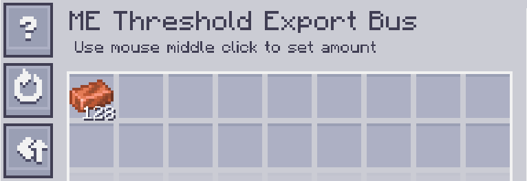

---
navigation:
    parent: epp_intro/epp_intro-index.md
    title: ME Threshold Export Bus
    icon: extendedae:threshold_export_bus
categories:
- extended devices
item_ids:
- extendedae:threshold_export_bus
---

# ME Threshold Export Bus

<GameScene zoom="8" background="transparent">
  <ImportStructure src="../structure/cable_threshold_export_bus.snbt"></ImportStructure>
</GameScene>

ME Threshold Export Bus operates when the quantity of an item stored in the ME network is above or below the threshold.

## Example

The copper threshold is set to 128, so it exports copper when the amount of copper stored in the network exceeds 128.

The threshold is the same as above, but the mode is set to BELOW. It exports copper when the amount of copper stored is below 128.
