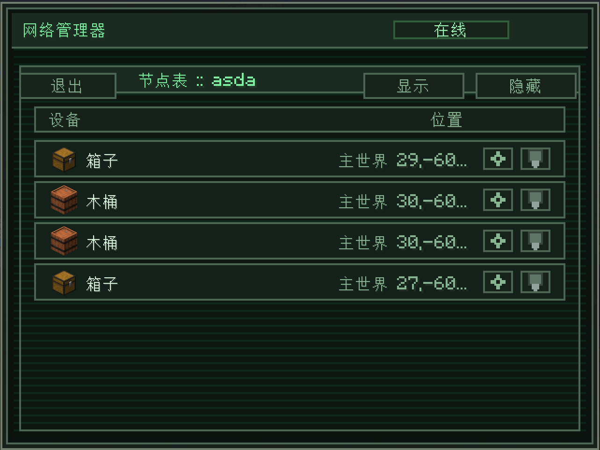
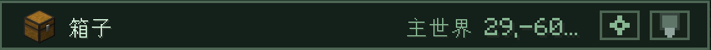

---
navigation:
  title: 节点表
  parent: computer/index.md
  position: 3
---

# 节点表

所挂载网络按节点归类的视图。其中会列出网络中的所有节点——同时显示其方块类型、位置，以及两个按钮，分别能在世界中高亮显示和远程编辑其配置。

在挂载网络后即可打开该界面。点击左上角的**退出**可返回。

## 节点表本身

每一行都对应网络中的一个节点。各列为：

- **设备**：节点所依附方块的物品图标，以及该方块的显示名称（`箱子`、`木桶`、`熔炉`等）。
- **位置**：维度与方块坐标。维度按名称显示（自定义维度显示相应简称）。坐标顺序为`X, Y, Z`。
- **操作**：每行右侧的两个带图标按钮。

### 行操作

- **高亮**（灯泡图标）：可通过**主要交互键（默认：左键）**切换世界中节点是否显示发光边框，便于定位。发光边框会持续显示，直到再次按下主要交互键或关闭电脑界面。
- **设置**（齿轮/终端图标）：**远程**打开节点的完整配置界面，无需实际前去交互。不站在节点旁边也能直接编辑其频道和过滤器。

编辑后可通过**返回节点表**以恢复包含所挂载网络、可滚动位置列表、可展开节点分组、节点选择、标签设置等的界面。在此处打开过滤器后返回的方式与前文所提相同。

## 标签分组

带有标签的节点会按标签归入同一个分组。标签的名称会显示为分组标题，对标题按下主要交互键可将整个分组收起为一行，再次按下可展开。未设置标签的节点会在列表最下方原样显示。

收起状态可在会话中保存——展开当前正操作的分组，收起其他分组，即可保证大型网络的节点表清晰明了。

标签可在节点的[标题 → 设置标签](../nodes/header.md)文本框中设置，使用[扳手 → 复制/粘贴](../wrench/copy-paste.md)会复制标签信息。

## 选择节点和批量设置标签

可通过勾选框选择节点。分组勾选框可用于选择所有成员；仅选择部分成员时会显示为部分选中形态。**同方块**会选择所有依附于同类型方块的节点。

可输入标签并将其应用于所有所选节点。已有的标签会自动应用其设置。新建标签时，需在选中的节点中选取复制源。共享升级配置需要物品栏或相链接的存储设备中有相应的升级物品；物品不足时即不会改动节点。可用空标签解除分组。

## 批量显示/隐藏

节点表右上角有两个按钮：

- **显示**：为所挂载网络中的所有节点**启用可见性渲染**。所有节点均会不透明地显示，无论是否手持扳手。
- **隐藏**：为所挂载网络中的所有节点**禁用**可见性渲染。节点只会在手持扳手时显示，且不会完全不透明。

如需要复习节点的可见性设置，参见[标题 → 可见性](../nodes/header.md)。

## 分页

可见行数由界面高度决定。位置新开一行以确保坐标完整显示。滚动滚轮可跳转分页。

## 小小提示

- 节点表使用实时信息。添加/移除节点，重设标签，可见/不可见状态的更改无需重新打开电脑。
- 远程设置会打开完整的节点界面，和在世界中交互打开的一样——过滤器、升级、所有频道均会显示。更改的提交方式和同实物交互一致。
- 高亮的边框仅客户端可见，且只有你可见，服务端中的其他玩家无法查看。
